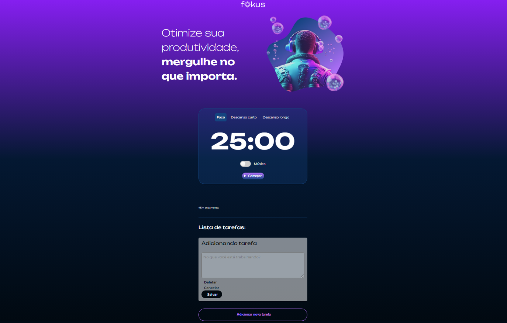

  <a href="#-tecnologias">Tecnologias</a>&nbsp;&nbsp;&nbsp;|&nbsp;&nbsp;&nbsp;
  <a href="#-projeto">Projeto</a>

  

## 🚀 Tecnologias

Esse projeto foi desenvolvido com as seguintes tecnologias:

- HTML
- CSS
- JavaScript
- [`vite`](https://nodejs.org/) - open-source web application framework

## 💻 Projeto

Feito para auxiliar na hora de manter o foco nos estudos, utilizando a metodologia pomodoro.  
Podem ser utilizadas pausas curtas ou longas, com ou sem música de fundo para concentração.  
Também possui sons de ativação para identificar cada opção selecionada.

